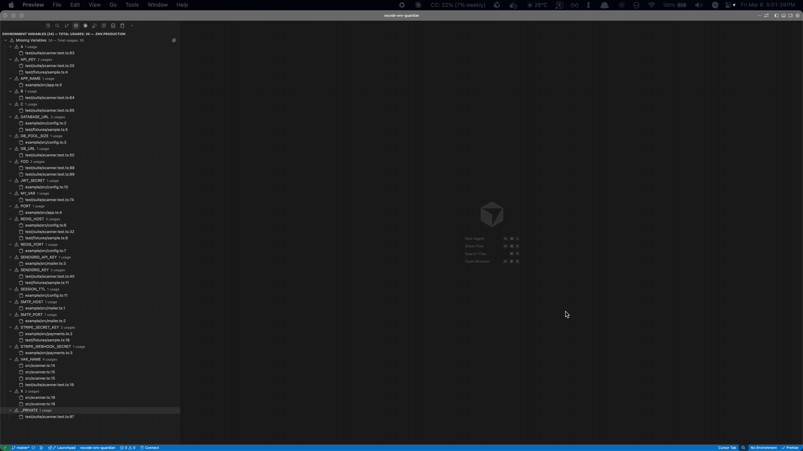

# Node Env Guardian

> **Disclaimer:** This extension was entirely vibe-coded with Claude Opus 4.6 on an extremely drowsy day out of frustration. Tread with caution.

Node Env Guardian is a VS Code extension for Node.js projects that scans all source files for `process.env.*` usages, tracks all `.env*` files, and surfaces missing variables so you catch problems at development time — not in production.

---

## Features

### Sidebar: Environment Variables Panel

Open any `.env*` file to see a sidebar with four categorized sections:

| Section | Icon | Description |
|---|---|---|
| **Missing Variables** | Warning | Variables used in code but not defined in the env file |
| **Commented Out Variables** | Comment | Variables commented out in the env file (e.g. `# API_KEY=value`) |
| **Defined Variables** | Check | Variables that are both defined and used |
| **Unused Variables** | Question | Variables defined in the env file but never referenced in code |

Each variable in the Missing, Commented Out, and Defined sections expands to show all source file locations where it's used. Click any location to jump directly to that line. Each section header has an inline expand button to expand all items within that section.


- Persists across editor switches — the last focused `.env*` file stays tracked when you navigate to non-env files
- The panel title shows the total variable count, total usages across all files, and the tracked file name (e.g. "Environment Variables (46) — Total usages: 120 — .env.dev")
- Each section header shows its variable count and total usages (e.g. "Missing Variables — 5 — Total usages: 18")
- Refreshes automatically on file save or when you switch editors

### Multi-File Tracking

By default, the sidebar tracks the last focused `.env*` file. You can pin files to compare multiple environments simultaneously:

- **Pin** (`$(pin)` in toolbar) — pins the current `.env*` file so it stays in the sidebar even when you switch editors
- **Unpin** (`$(pinned)` inline button) — removes the pin from a file; shown on pinned file headers
- **Close** (`$(close)` inline button) — removes an unpinned active file from the view
- **Drag & drop** — drag `.env*` files from the Explorer into the sidebar to pin them

When multiple files are tracked, each appears as a top-level collapsible node with its own set of sections (Missing, Commented Out, Defined, Unused). When only one unpinned file is active, sections are shown flat at the root level (original behavior).

### Switching Between Env Files

The sidebar updates as you focus different `.env*` files, making it easy to compare coverage across environments (e.g. `.env.dev` might show 11 missing while `.env.local` shows only 1).

### Commented Out Variables Section

Variables that are commented out in your `.env*` file (e.g. `# API_KEY=value`) are shown in a separate **"Commented Out Variables"** section, visually separated from truly missing variables. This section can be toggled on/off with the comment button in the toolbar.

### Sidebar Toolbar

The sidebar title bar includes the following buttons (left to right):

| Button | Icon | Description |
|---|---|---|
| Refresh | `$(refresh)` | Force-refresh the sidebar tree view |
| Add All Missing | `$(add)` | Append all missing variables (excluding commented-out) as `VAR=` stubs to the tracked `.env*` file |
| Toggle Commented | `$(comment)` | Show or hide the "Commented Out Variables" section |
| Encrypt Secrets | `$(lock)` | Encrypt the tracked `.env*` file using [dotenvx](https://dotenvx.com/) |
| Decrypt Secrets | `$(unlock)` | Decrypt the tracked `.env*` file using dotenvx |
| Pin File | `$(pin)` | Pin the current `.env*` file to track it alongside other pinned files |
| Expand All | `$(expand-all)` | Incrementally expand tree nodes — one level per press |
| Collapse All | (built-in) | Collapse all expanded tree nodes |

### Encrypt & Decrypt with dotenvx

The toolbar includes **lock** and **unlock** buttons for encrypting and decrypting the tracked `.env*` file using [dotenvx](https://dotenvx.com/).

- **Encrypt** (`$(lock)`) — encrypts values in-place. The encryption key is saved to `~/.dotenvx-keys/<project>/<envfile>.key` by default (customizable via an input prompt). If dotenvx is not installed, you'll be offered to install it as a dev dependency.
- **Decrypt** (`$(unlock)`) — decrypts values in-place using the key file. If the key is not found at the default path, you'll be prompted to provide the path.

Keys are stored outside the workspace by default so they are not accidentally committed to version control.

### Inline Diagnostics (Squiggles)

- **Warning** — variable is not defined in *any* `.env*` file in the workspace
- **Information** — variable is defined in some files but missing from others (e.g. in `.env.development` but not `.env.production`)

Diagnostics update live as you edit source files or save `.env*` files.

### Quick Fix Code Actions

Right-click a warning squiggle and choose:
- **Add `VAR_NAME` to .env file…** — pick which `.env*` file to add the stub to
- **Add `VAR_NAME` to all .env files** — adds `VAR_NAME=` to every `.env*` file that's missing it

### Commands

| Command | Description |
|---|---|
| `Node Env Guardian: Refresh` | Force-refresh the sidebar tree view |
| `Node Env Guardian: Expand All` | Incrementally expand tree nodes one level per press |
| `Node Env Guardian: Add All Missing Variables to .env` | Bulk-add all missing variables to the tracked `.env*` file |
| `Node Env Guardian: Toggle Commented Out Variables` | Show/hide the commented-out variables section |
| `Node Env Guardian: Encrypt Secrets` | Encrypt the tracked `.env*` file with dotenvx |
| `Node Env Guardian: Decrypt Secrets` | Decrypt the tracked `.env*` file with dotenvx |
| `Node Env Guardian: Pin Current .env File` | Pin the current env file to the sidebar for multi-file tracking |
| `Node Env Guardian: Generate Ignore File` | Create a `.node-env-guardian-ignore` file with default exclude patterns |
| `Unpin` | Remove the pin from a tracked file (inline on pinned file headers) |
| `Close` | Remove an unpinned active file from the view (inline on active file headers) |
| `Copy Variable Name` | Copy the missing variable name to the clipboard (context menu) |
| `Add to current .env file` | Append `VAR_NAME=` to the currently active `.env*` file (context menu) |
| `Add to current .env file (commented out)` | Append `# VAR_NAME=` to the currently active `.env*` file (context menu) |
| `Go to Usage` | Navigate to the usage in source code — QuickPick if multiple (context menu) |

---

## How It Works

**Scanning** — on activation, Node Env Guardian scans all `.js`, `.ts`, `.jsx`, `.tsx`, `.mjs`, `.cjs`, `.mts`, and `.cts` files for `process.env.*` references using regex matching (not a full AST parser, so it's fast). It skips `node_modules`, `dist`, `build`, `out`, `.next`, and `coverage` by default. On refresh, previous scan data is fully cleared before re-scanning, ensuring stale entries from deleted or excluded files don't persist.

**Custom ignore file** — if a `.node-env-guardian-ignore` file exists at the workspace root, its glob patterns are used *instead of* the default exclude list and the `envGuardian.excludeGlobs` setting. One pattern per line; blank lines and lines starting with `#` are ignored. Run the command `Node Env Guardian: Generate Ignore File` to create one pre-populated with the defaults.



**Env file parsing** — all `.env*` files at the workspace root are automatically parsed for `KEY=` definitions and `# KEY=` commented-out definitions. Any `.env*` file you open or pin is also tracked, even if it's in a subdirectory. The value is ignored; presence of the key is all that matters.

**Comparison** — the sidebar and diagnostics compare the set of *used* variables against the set of *defined* variables to find the gap. Commented-out variables are tracked separately and displayed in their own section.

---

## Extension Settings

| Setting | Default | Description |
|---|---|---|
| `envGuardian.sourceGlobs` | `["**/*.{js,ts,jsx,tsx,mjs,cjs,mts,cts}"]` | Glob patterns for source files to scan |
| `envGuardian.excludeGlobs` | `["**/node_modules/**", ...]` | Glob patterns to exclude from scanning |
| `envGuardian.envFilePattern` | `.env*` | Glob for environment files at workspace root |
| `envGuardian.diagnostics.enabled` | `true` | Show inline squiggles in source files |
| `envGuardian.diagnostics.partialWarnings` | `true` | Show Info diagnostics for partially-defined variables |

---

## Known Limitations

- **Dynamic access is not tracked.** `process.env[dynamicVar]` is intentionally ignored — only statically analyzable string keys are indexed.
- **Comments are scanned.** A `// process.env.FOO` in a comment will be tracked. This is intentional as commented-out references are still a useful signal.
- **Auto-discovery is workspace-root only.** `.env*` files in subdirectories are not auto-discovered, but are tracked when you open or pin them.
- **Multi-root workspaces** are supported; each folder is scanned independently.

---

## Activation

Node Env Guardian activates automatically when a `package.json` is found in the workspace, indicating a Node.js project.

---

## Development

```bash
npm install
npm run compile        # one-shot TypeScript compile
npm run watch          # watch mode

# Run unit tests (no VS Code required):
npx mocha --require ./test/vscode-mock.js --ui tdd out/test/suite/*.test.js
```

To run the full integration test suite, open the project in VS Code and press `F5` to launch the Extension Development Host, then run `npm test`.

---

## Future Enhancements

- **IntelliSense completions** for `process.env.` based on defined variables
- **Hover value preview** — see a variable's value from each env file on hover
- **Diff view** — compare two `.env` files side-by-side
- **Export** — generate a `.env.example` from all discovered usages
